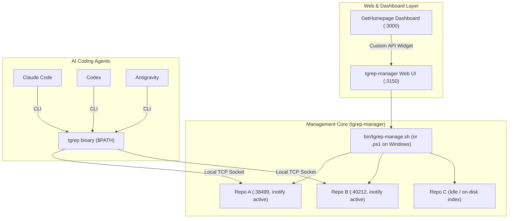

# ⚡ tgrep-manager

> Cross-platform Web Dashboard & CLI Daemon Controller for [Microsoft tgrep](https://github.com/microsoft/tgrep) (Trigram Inverted-Index Code Search) across multi-repository workspaces.

[](https://opensource.org/licenses/MIT)
[](https://bun.sh)
[](https://github.com/microsoft/tgrep)
[](https://bulma.io)
[]()

---

## 🎯 What is this & Why do you need it?

[Microsoft `tgrep`](https://github.com/microsoft/tgrep) is an open-source, trigram-indexed grep tool. It pre-computes an inverted index of 3-character substrings (trigrams), allowing it to **prune 99% of non-matching files in microseconds** and search multi-gigabyte codebases in **< 10 milliseconds**.

When integrating with AI coding assistants (**Claude Code**, **Codex**, **Antigravity**) across multiple repositories, developers encounter common workflow hurdles:
1. **Background daemon supervision**: Running `tgrep serve` in multiple folders requires managing independent TCP ports and avoiding accidental terminal disconnections.
2. **Resource efficiency**: Developers don't want every repo burning background CPU/RAM when idle.
3. **AI agent alignment**: AI agents default to unindexed brute-force `grep` unless instructed to prioritize indexed tools.

**`tgrep-manager`** solves all of this:
- 🖥️ **Bulma 1.0 Dark Mode Web UI**: An elegant, high-density dashboard on port `3150` to view, start, stop, and re-index repositories on demand.
- ⚡ **Cross-Platform CLI**: Native scripts for **Linux/macOS** (`.sh`) and **Windows** (`.ps1`).
- 📊 **GetHomepage Native Tile**: Built-in `/api/widget` endpoint providing live counters (Active Daemons, Indexed Repos, Total Repos) and ping health monitors.
- 🤖 **Agent-Ready Global Policies**: Clean drop-in templates for Claude Code, Codex, and Antigravity that don't pollute team git repositories.

---

## 📐 Architecture



---

## 📦 Requirements & Installation by OS

### 1. Install `tgrep` (The Search Engine)

* **Linux & macOS (Cargo)**:
  ```bash
  cargo install --git https://github.com/microsoft/tgrep.git tgrep-cli --locked
  ```
* **macOS (Homebrew)**:
  ```bash
  brew install tgrep
  ```
* **Windows (PowerShell / Cargo)**:
  ```powershell
  cargo install --git https://github.com/microsoft/tgrep.git tgrep-cli --locked
  ```

---

### 2. Install [Bun](https://bun.sh) (Web Engine Runtime)

* **Linux / macOS**:
  ```bash
  curl -fsSL https://bun.sh/install | bash
  ```
* **Windows (PowerShell)**:
  ```powershell
  powershell -c "irm bun.sh/install.ps1 | iex"
  ```

---

## ⚙️ Configuration Guide: Global vs. Project-Level

To prevent merge conflicts and team friction, understand what belongs at the **Machine (Global)** level versus the **Project** level:

```
┌─────────────────────────────────────────────────────────────┐
│ 🌐 MACHINE / GLOBAL LEVEL (Configured once per machine)     │
│   • tgrep & ast-grep binaries in $PATH                      │
│   • Global gitignore: ignore .tgrep across all repos        │
│   • Global agent policy: ~/.claude/CLAUDE.md                │
│   • Global agent policy: ~/.codex/instructions.md           │
├─────────────────────────────────────────────────────────────┤
│ 📂 PROJECT / REPO LEVEL (Per individual repository)         │
│   • .tgrep/ folder (generated on demand via tgrep index)    │
│   • (Optional) Fallback rules in project CLAUDE.md          │
└─────────────────────────────────────────────────────────────┘
```

### 1. Global Git Ignore (Prevents Committing `.tgrep` Index)
Run once on your machine:
```bash
# Linux / macOS:
mkdir -p ~/.config/git && echo ".tgrep" >> ~/.config/git/ignore
git config --global core.excludesfile ~/.config/git/ignore

# Windows (PowerShell):
New-Item -ItemType Directory -Path "$env:USERPROFILE\.config\git" -Force
Add-Content -Path "$env:USERPROFILE\.config\git\ignore" -Value ".tgrep"
git config --global core.excludesfile "$env:USERPROFILE\.config\git\ignore"
```

### 2. Global AI Agent Configuration (No Git Pollution)

* **Claude Code**: Place `agent-configs/CLAUDE.md` into `~/.claude/CLAUDE.md`. Claude Code merges this with every project automatically.
* **Codex**: Place `agent-configs/CODEX.md` into `~/.codex/instructions.md`.
* **Antigravity**: Place `agent-configs/SKILL.md` into `~/.agents/skills/codebase-indexing/SKILL.md`.

---

## 🚀 Running `tgrep-manager`

### Option A: Run Natively with Bun (All Platforms)

```bash
# Clone the repository
git clone https://github.com/<YOUR_USERNAME>/tgrep-manager.git
cd tgrep-manager

# Start the dashboard (scans parent directory by default)
SOURCE_DIR=/path/to/your/projects bun run src/server.ts
```
Open **`http://localhost:3150`** in your browser.

---

### Option B: Run as a Linux Systemd User Service (Persistent 24/7)

```bash
mkdir -p ~/.config/systemd/user
cp systemd/tgrep-manager.service ~/.config/systemd/user/
systemctl --user daemon-reload
systemctl --user enable --now tgrep-manager.service

# (Optional) Allow service to run at boot without active SSH session:
sudo loginctl enable-linger $USER
```

---

### Option C: Run with Docker Compose

```bash
# Set your workspace path and launch container:
WORKSPACE_DIR=/path/to/source-code docker compose up -d
```

---

## 💻 Cross-Platform CLI Usage

### Linux & macOS (`bin/tgrep-manage.sh`):
```bash
./bin/tgrep-manage.sh list             # Table of all repos with status & ports
./bin/tgrep-manage.sh start my-project # Start detached inotify daemon
./bin/tgrep-manage.sh stop my-project  # Stop running daemon
./bin/tgrep-manage.sh index my-project # Rebuild trigram index
./bin/tgrep-manage.sh status my-project
```

### Windows PowerShell (`bin\tgrep-manage.ps1`):
```powershell
.\bin\tgrep-manage.ps1 list
.\bin\tgrep-manage.ps1 start my-project
.\bin\tgrep-manage.ps1 stop my-project
.\bin\tgrep-manage.ps1 index my-project
.\bin\tgrep-manage.ps1 status my-project
```

---

## 🌐 GetHomepage Integration

Add a glowing, live-updating card with telemetry counters to your [GetHomepage](https://gethomepage.dev/) dashboard:

### 1. Add to `services.yaml`
```yaml
    - Code Indexer:
        id: tgrep-manager
        icon: mdi-lightning-bolt
        href: http://<SERVER_IP>:3150
        description: Trigram Index & Search Manager
        target: _blank
        siteMonitor: http://<SERVER_IP>:3150
        widget:
          type: customapi
          url: http://<SERVER_IP>:3150/api/widget
          refreshInterval: 5000
          mappings:
            - field: running
              label: Active
            - field: indexed
              label: Indexed
            - field: total
              label: Repos
```

### 2. Optional D.Va / Cyberpunk Card CSS (`custom.css`)
See [homepage-integration/custom.css](homepage-integration/custom.css) for smooth gradient borders and hover animations.

---

## 📊 In-Depth Research & Benchmarks

* 📈 **[Telemetry & Token Savings Guide](docs/telemetry-and-token-savings.md)**: Mathematical breakdown of trigrams, why AST parsing cuts token waste by 80-90%, and how to measure agent metrics.
* 🧪 **[Empirical A/B Benchmark Report](docs/ab-test-benchmark.md)**: Real-world test running Claude Code autonomously against an enterprise monorepo (1,792 files), saving 12.9% output tokens and 1.6s wall-clock latency.

---

## 🔌 REST API Reference

| Method | Endpoint | Description | Sample Output |
| :--- | :--- | :--- | :--- |
| `GET` | `/api/projects` | List all discovered projects & status | `[{"name":"my-app","indexed":true,"running":true,"port":38499}]` |
| `GET` | `/api/widget` | Real-time metrics for dashboard widgets | `{"running":1,"indexed":3,"total":5}` |
| `POST` | `/api/action` | Trigger lifecycle action (`start`,`stop`,`index`) | `{"success":true,"output":"✓ Started."}` |

---

## 📄 License

MIT © 2026 tgrep-manager contributors
